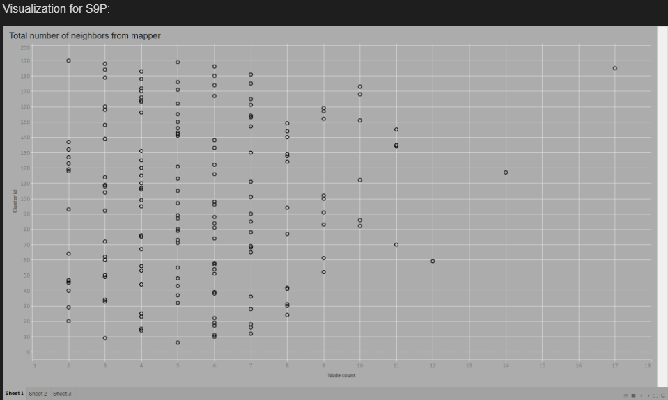
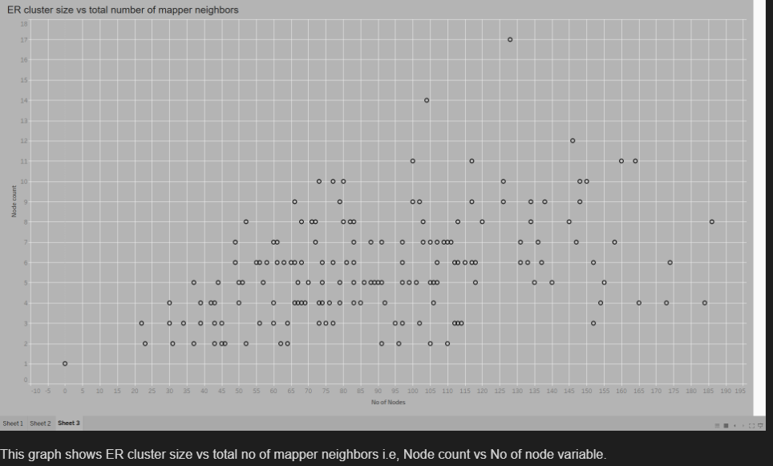
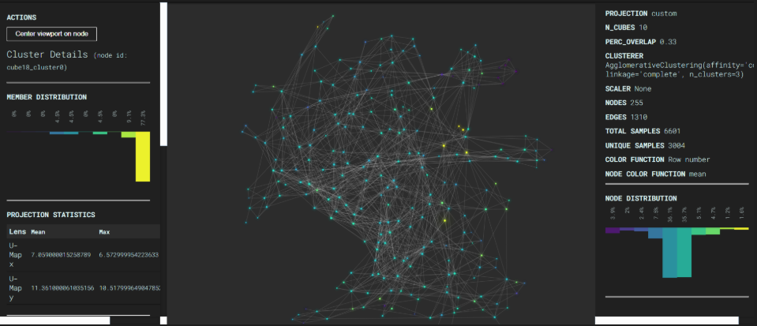
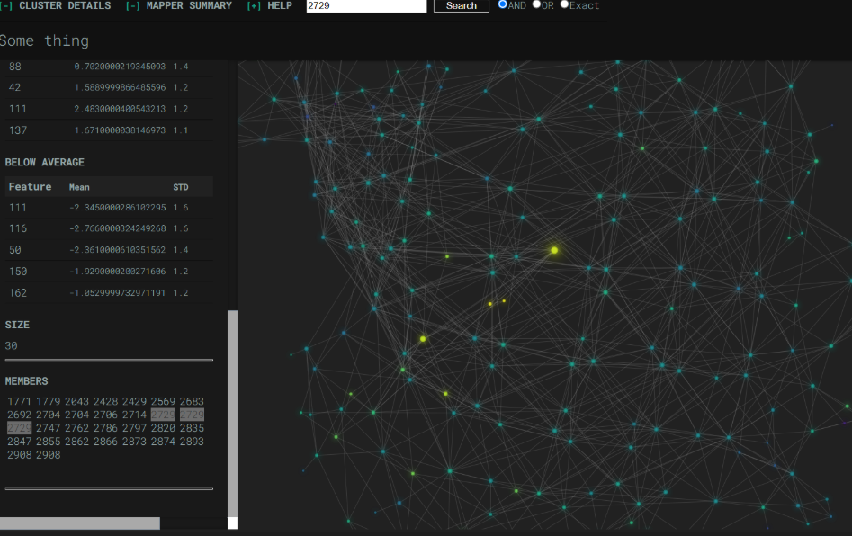

# Choosing the Most Accurate Variation from an Entity Resolution Cluster using TDA

## Overview
This project addresses the challenge of selecting the **most accurate or complete** record among multiple variations of the same entity within an entity resolution (ER) cluster.  
We use **Topological Data Analysis (TDA)** — specifically **UMAP** for dimensionality reduction and **Mapper (KeplerMapper)** for topological graph construction — to determine which variation is most connected to the rest of the dataset.

---

## Problem Statement
When multiple versions of an entity exist, even humans find it hard to decide which is the best representation. Algorithms face an even greater challenge.  
We propose a method that evaluates how closely each record variation is linked to the rest of the dataset using TDA, and selects the one with the highest connectivity.

---

## Proposed Solution
1. Identify all variations of an entity in the dataset.
2. Iteratively remove one variation and run the **TDA pipeline**:
   - Clean and encode the data.
   - Reduce dimensions using **UMAP**.
   - Build the **Mapper** graph.
   - Count the number of neighbors for the remaining variation(s).
3. Swap the removed variation and repeat the process.
4. Select the variation with the highest neighbor count.
5. Extend to >2 variations by removing all but one and checking neighbors.

---

## Data
- **Type:** Unstructured person-like records with fields:  
  `RecID, fname, lname, mname, address, city, state, zip, ssn`
- **Issues:** Missing values, typos, inconsistent casing, punctuation noise.
- **Ground Truth:** Cluster IDs available in truth files for evaluation.

---

## Methodology
- **Data Preparation:**  
  - Load and clean using regex (remove punctuation, standardize case, fix misspellings).
  - Assign Cluster IDs from truth files.
- **Encoding:**  
  - Word embeddings from tokenized text.
- **Dimensionality Reduction:**  
  - **UMAP** selected over t-SNE for preserving local structure and efficiency.
- **Topological Data Analysis:**  
  - Build overlapping bins → cluster within bins → create nodes → connect shared members.
- **Comparative Analysis:**  
  - Count neighbors for each variant using the Mapper graph.

---

## Results
**Tested Files:** S1G, S5G (Good data), S8P, S9P (Poor data)  
| File | Time Taken | Records | Quality |
|------|------------|---------|---------|
| S1G  | 2h 24m     | 51      | Good    |
| S5G  | 7h (batched) | 3005   | Good    |
| S8P  | 2h         | 1001    | Poor    |
| S9P  | 1h 49m     | 1001    | Poor    |

- Output includes `.tsv` files with: Record ID, Node Counts, Number of Nodes.
- Tableau visualizations:
-    
  - **Node Count vs Number of Node Variables**
       ]

- UMAP Visulization
-    
- Nearest Neighbour in UMAP
-    
  

